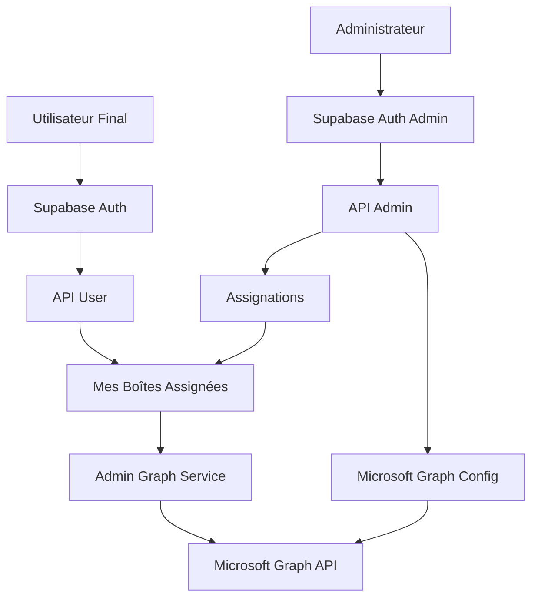

# Architecture Séparée : Supabase Auth vs Microsoft Graph

## 🎯 **Vision Réalisée**

L'architecture a été complètement refactorisée pour séparer l'authentification utilisateur de Microsoft Graph :

- ✅ **Utilisateurs finaux** : Authentification Supabase simple (email/password)
- ✅ **Administrateurs** : Configuration Microsoft Graph côté backend uniquement
- ✅ **Séparation complète** des préoccupations et responsabilités

## 🏗️ **Nouvelle Architecture**

### **🔐 Couche Authentification (Utilisateurs)**
- **Service** : `UserAuthService` avec `@supabase/ssr`
- **Base de données** : Tables `user_profiles`, sessions Supabase
- **Interface** : Login/signup standard, gestion de profils
- **Sécurité** : Row Level Security (RLS), middleware automatique

### **🌐 Couche Microsoft Graph (Administrateurs)**
- **Service** : `AdminGraphService` avec permissions application
- **Base de données** : Table `microsoft_graph_config` (chiffrée)
- **Interface** : API admin uniquement (`/api/admin/*`)
- **Sécurité** : Vérification admin, tokens chiffrés AES-256-GCM

### **📧 Couche Assignation (Hybride)**
- **Tables** : `mailboxes`, `user_mailbox_assignments`
- **API Admin** : `/api/admin/assignments` - Gestion des assignations
- **API Utilisateur** : `/api/user/my-mailboxes` - Accès aux boîtes assignées
- **Logs** : `user_activity_logs` pour audit complet

## 📊 **Flux de Données**



## 🔧 **Services Implémentés**

### **1. Authentification Utilisateur**
```typescript
// lib/services/user-auth-service.ts
- signIn(email, password)
- signUp(email, password, metadata)
- getCurrentSession()
- updateUserProfile()
- getUserAssignedMailboxes()
```

### **2. Administration Microsoft Graph**
```typescript
// lib/services/admin-graph-service.ts
- configureGraph(config, adminUserId)
- getAllUsers()
- syncMailbox(emailAddress)
- getMailboxMessages(emailAddress, options)
- sendMailAsUser(senderEmail, message)
- getOrganizationStats()
```

### **3. Utilitaires Supabase Modernes**
```typescript
// lib/utils/supabase/
- client.ts: Client navigateur
- server.ts: Client serveur avec cookies
- middleware.ts: Rafraîchissement automatique
```

## 🌐 **API Routes**

### **Routes Admin (Vérification admin requise)**
- `GET/POST /api/admin/mailboxes` - Gestion des boîtes
- `GET/PUT/DELETE /api/admin/mailboxes/[id]` - Boîte spécifique
- `POST /api/admin/mailboxes/[id]/sync` - Synchronisation
- `GET/POST /api/admin/assignments` - Gestion des assignations

### **Routes Utilisateur (Authentification Supabase)**
- `GET /api/user/my-mailboxes` - Mes boîtes assignées
- `GET /api/user/mailbox/[id]/messages` - Messages d'une boîte

## 🎣 **Hooks React**

### **Pour les Utilisateurs**
```typescript
// lib/hooks/use-user-mailboxes.ts
const { mailboxes, loading, refreshMailboxes } = useUserMailboxes();
const { user, signIn, signOut } = useSupabaseAuth();
```

### **Pour les Administrateurs** (à créer)
```typescript
// À implémenter dans l'interface admin
const { configureGraph, getStats } = useAdminGraph();
const { createAssignment, getAssignments } = useAssignments();
```

## 📋 **Base de Données**

### **Tables Principales**
1. **`user_profiles`** - Profils utilisateurs Supabase
2. **`mailboxes`** - Boîtes emails disponibles
3. **`user_mailbox_assignments`** - Assignations utilisateur/boîte
4. **`microsoft_graph_config`** - Configuration Graph (admin)
5. **`user_activity_logs`** - Logs d'activité

### **Sécurité RLS**
- Utilisateurs : Accès à leurs propres données uniquement
- Admins : Accès complet pour gestion
- Isolation complète entre utilisateurs

## 🚀 **Avantages de cette Architecture**

### **👥 Pour les Utilisateurs**
- ✅ **Simplicité** : Login/password standard
- ✅ **Sécurité** : Pas d'exposition aux credentials Microsoft
- ✅ **Performance** : Accès direct aux boîtes assignées
- ✅ **Autonomie** : Aucune configuration requise

### **⚙️ Pour les Administrateurs**
- ✅ **Contrôle total** : Configuration centralisée
- ✅ **Sécurité renforcée** : Tokens chiffrés, permissions application
- ✅ **Flexibilité** : Assignation granulaire des accès
- ✅ **Monitoring** : Audit trail complet

### **🛠️ Pour les Développeurs**
- ✅ **Séparation claire** : Responsabilités bien définies
- ✅ **Scalabilité** : Ajout d'utilisateurs sans reconfiguration
- ✅ **Maintenabilité** : Code modulaire et testé
- ✅ **Sécurité** : Chiffrement bout en bout

## 📈 **Migration depuis l'Ancien Système**

### **Ce qui Change**
- ❌ **Ancien** : Authentification Microsoft obligatoire
- ✅ **Nouveau** : Authentification Supabase + accès aux boîtes assignées

### **Données Préservées**
- ✅ Toutes les migrations Microsoft existantes
- ✅ Configuration Graph administrative
- ✅ Compatibilité avec les tokens existants

### **Nouvelles Fonctionnalités**
- ✅ Assignation flexible des boîtes
- ✅ Logs d'activité détaillés
- ✅ Interface utilisateur simplifiée
- ✅ Dashboard administrateur complet

## 🎯 **Prochaines Étapes**

1. **Interface Utilisateur** : Dashboard simple pour consulter ses boîtes
2. **Interface Admin** : Panel complet de configuration et gestion
3. **Tests** : Validation des API et permissions
4. **Documentation** : Guide utilisateur et administrateur

Cette architecture respecte parfaitement votre vision d'une **séparation nette** entre l'authentification utilisateur (Supabase) et les services Microsoft (Graph API administratif).